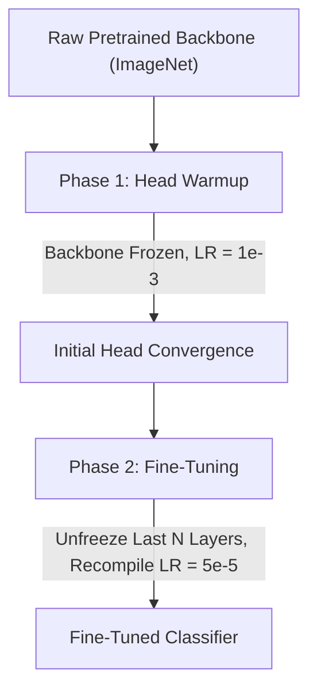

# TFLite CNN Pipeline — Complete Developer Reference

> **Deep Learning · TensorFlow / Keras · Mobile Deployment (Android / iOS) · Best Practices**  
> Architected for production-grade computer vision models running on edge devices via TensorFlow Lite.

---

## 🗺 1. The Full Pipeline Map
*Understand the 8 stages before touching any code.*

Every TFLite CNN pipeline flows through eight sequential stages. A mistake in any stage propagates silently downstream and typically manifests as **confidently wrong predictions on the edge device** — the hardest class of bugs to diagnose.

```text
Raw Images
   │
   ▼
[1] Data Collection + Quality Gate
   │  PIL verify(), corrupt image removal, download sentinels
   ▼
[2] Folder → Class Mapping
   │  Separator normalization (spaces & underscores), variety-to-parent merging
   ▼
[3] Data Pipeline (ImageDataGenerator / tf.data)
   │  Raw [0, 255] pixel feed — NO rescaling here!
   ▼
[4] Model Architecture
   │  Preprocessing INSIDE model graph, serializable layers with get_config()
   ▼
[5] Training (Phase 1 Head → Phase 2 Fine-Tune)
   │  LR warmup + cosine decay, architecture-specific BN strategy, mixed precision
   ▼
[6] Evaluation
   │  Generator reset(), per-class metrics, confusion matrix, ensemble
   ▼
[7] TFLite Export
   │  Standard + FP16 export, SELECT_TF_OPS fallback, numerical parity verification
   ▼
[8] Mobile Deployment (Android / Python)
      Feed raw [0, 255] float32 RGB pixels — model normalizes internally
      Confidence gating & Background class thresholding
```

> [!IMPORTANT]
> **The Golden Contract**: The contract between **Stage [3]** and **Stage [4]** is where most pipelines fail. The data pipeline must output raw `[0, 255]` images. The model consumes raw pixels and handles normalization internally. If both normalize, the model is doubly normalized and fails silently in the field.

---

## ⚡ 2. Preprocessing — The #1 Rule
*Where normalization lives determines production reliability.*

Preprocessing **must live inside the model graph**, not in data loaders or client-side application code.

### The Three Approaches

| Pattern | Code | Result | Status |
| :--- | :--- | :--- | :--- |
| **Pipeline Rescaling** | `ImageDataGenerator(rescale=1./255)` | Exported TFLite expects `[0, 1]`. Phone camera feeds `[0, 255]` → Garbage predictions. | ❌ **Broken** |
| **Lambda Layer** | `Lambda(mobilenet_v2.preprocess_input)` | Model cannot be reloaded without custom scope; TFLite converter crashes. | ❌ **Broken** |
| **Native Rescaling** | `Rescaling(1./127.5, offset=-1.0)` | Native TFLite kernel, serializable, mobile apps feed raw `[0, 255]`. | ✅ **Correct** |
| **Custom Layer** | `EfficientNetPreprocess(Layer)` | Full ImageNet `(x/255 - μ)/σ` support with `get_config()` / `from_config()`. | ✅ **Correct** |

### Per-Architecture Normalization Contracts

| Architecture | Target Range | Mathematical Formula | Keras Implementation |
| :--- | :--- | :--- | :--- |
| **MobileNetV2 / V3** | `[-1.0, 1.0]` | $x / 127.5 - 1.0$ | `layers.Rescaling(1./127.5, offset=-1.0)` |
| **EfficientNet (B0–B7)** | ImageNet std | $(x / 255.0 - \mu) / \sigma$ | Subclassed `EfficientNetPreprocess` |
| **ResNet50 / VGG** | Mean-subtracted | $x_{\text{BGR}} - [103.9, 116.8, 123.7]$ | Custom Caffe-style Layer |
| **InceptionV3** | `[-1.0, 1.0]` | $x / 127.5 - 1.0$ | `layers.Rescaling(1./127.5, offset=-1.0)` |

---

## 🧱 3. Custom Keras Layers
*Serialization, training flags, and compute dtype.*

Every custom Keras layer must satisfy four structural requirements:

```python
class MyCustomLayer(tf.keras.layers.Layer):
    """Production-grade custom layer template."""
    
    # 1. __init__: accept configuration parameters as explicit keyword arguments
    def __init__(self, threshold=240, **kwargs):
        super().__init__(**kwargs)
        self.threshold = threshold

    # 2. call: gate training-only ops (randomness, augmentation) behind training flag
    def call(self, inputs, training=None):
        if training:
            # Random operations run ONLY during model.fit()
            noise = tf.random.uniform(tf.shape(inputs), 0.0, 1.0)
            return inputs + noise
        return inputs  # Pure identity during inference and TFLite conversion

    # 3. get_config: serialize every constructor argument
    def get_config(self):
        config = super().get_config()
        config.update({'threshold': self.threshold})
        return config

    # 4. from_config: cleanly reconstruct layer from saved configuration
    @classmethod
    def from_config(cls, config):
        return cls(**config)
```

> [!CAUTION]
> If random operations (`tf.random.*`) are executed unconditionally inside `call()`, TFLite conversion traces those operations into the static graph, causing either conversion crashes or non-deterministic mobile inference.

---

## 🔍 4. Dataset Quality & Quality Gates
*Catch corrupt images, partial downloads, and security exploits before training starts.*

1. **PIL Integrity Verification**:
   Scan every image on disk with `PIL.Image.open(p).verify()` to discard truncated or zero-byte images prior to building generators.
2. **Sentinel Files**:
   Never assume directory presence implies download success. Write `.download_complete` only upon successful extraction. On failure, purge the partial directory.
3. **ZIP Path Traversal Security**:
   Always validate extraction targets against canonical base directories to block Zip Slip vulnerabilities:
   ```python
   def safe_extract_member(zf, member, dest_dir):
       dest_dir = os.path.abspath(dest_dir)
       target = os.path.abspath(os.path.join(dest_dir, member))
       if not target.startswith(dest_dir + os.sep):
           raise ValueError(f"Blocked path traversal attempt in zip: {member!r}")
       zf.extract(member, dest_dir)
   ```
4. **Resilient File Copying**:
   Wrap `shutil.copy2` operations in `try...except OSError` blocks and log failures to safeguard against disk quota exhaustion or permission errors.

---

## 🎨 5. Augmentation
*Train-only, raw pixel domain, no test contamination.*

- Augmentation operates on raw `[0, 255]` pixel data **before** normalisation layers.
- For domain adaptation (e.g., synthetic white background replacement), thresholding logic ($x > 240$) is valid only in the unsigned 8-bit or unscaled float32 domain.
- Validation and Test sets must **never** be augmented.

---

## ⚖️ 6. Class Imbalance
*Balance gradients and step counts across uneven splits.*

- **Ceiling Division for Steps**:
  Never use floor division (`//`) when defining `steps_per_epoch` or `validation_steps`. Floor division silently drops the final partial batch of every epoch.
  ```python
  steps_per_epoch = max(1, math.ceil(train_generator.samples / BATCH_SIZE))
  validation_steps = max(1, math.ceil(val_generator.samples / BATCH_SIZE))
  ```
- **Balanced Class Weights**:
  Pass `class_weight` computed via scikit-learn's `compute_class_weight('balanced', ...)` to `model.fit()`.
- **Background Minority Strategy**:
  When synthetic or real background samples are fewer than domain target classes, enforce class weighting to prevent recall degradation.

---

## 🔀 7. Transfer Learning Strategy
*Two-phase optimization and optimizer recompilation.*



1. **Phase 1 (Head Only)**:
   Freeze backbone (`base_model.trainable = False`). Train custom head for 5–10 epochs with a standard learning rate ($10^{-3}$) to initialize head weights without destroying backbone features.
2. **Phase 2 (Fine-Tuning)**:
   Unfreeze the top $N$ layers (`base_model.layers[-FINE_TUNE_LAYERS:]`).
3. **Mandatory Optimizer Recompile**:
   Always call `model.compile(...)` before Phase 2. This resets Adam's first and second momentum buffers ($m_t, v_t$). Reusing Phase 1 momentum on newly unfrozen layers causes severe gradient spikes and catastrophic forgetting.

---

## 📊 8. Batch Normalization Strategy During Fine-Tuning
*Preventing feature drift versus adapting statistics.*

| Architecture | Fine-Tune BN Setting | Technical Rationale |
| :--- | :--- | :--- |
| **MobileNetV2** | **Frozen** (`layer.trainable = False`) | Depthwise separable layers with small fine-tune LR ($5\times 10^{-5}$) suffer statistic drift when updated on small mini-batches. Freezing maintains stable ImageNet running statistics. |
| **EfficientNetB0** | **Trainable** (`layer.trainable = True`) | With batch size $\ge 64$, compound-scaled MBConv blocks benefit from adapting running mean and variance to the target domain distribution. |
| **All Backbones** | **Stem BN Frozen** | Early low-level feature extraction layers must never have their normalization statistics updated. |

---

## ⚗️ 9. Mixed Precision
*Accelerated GPU training with numerical stability.*

```python
# Enable mixed float16 globally
tf.keras.mixed_precision.set_global_policy('mixed_float16')

# Crucial: Output classification head must force float32
outputs = layers.Dense(num_classes, activation='softmax', dtype='float32', name='predictions')(x)
```

- **Head Stability**: Softmax activations and loss calculations in float16 easily overflow or underflow. Explicitly setting `dtype='float32'` on the final Dense layer isolates float16 to the feature extractor.
- **TFLite Export Consequence**: Mixed-precision graphs include cast operations that necessitate `SELECT_TF_OPS` (Flex delegate) when converting to TFLite unless full INT8 quantization is applied.

---

## 📈 10. Learning Rate Schedule
*Per-step linear warmup + cosine decay.*

- Schedule learning rate **per step**, not per epoch.
- Set warmup epochs according to architecture depth:
  - `WARMUP_EPOCHS_MN = 1` for MobileNetV2 (shallower, converges rapidly).
  - `WARMUP_EPOCHS_EF = 2` for EfficientNetB0 (deeper, requires gentler gradient ramp).
- Minimum learning rate floor: $10^{-6}$ for fine-tuning.

---

## 🔔 11. Production Callbacks
*Surviving interruptions and preventing divergence.*

1. **`ModelCheckpoint`**:
   Monitor `val_accuracy` (not `val_loss`). Save best weights directly to persistent cloud storage (Google Drive).
2. **`EarlyStopping`**:
   Monitor `val_accuracy`. Ensure `patience \ge WARMUP_EPOCHS + 4` to prevent premature termination while the learning rate is ramping up.
3. **`TerminateOnNaN`**:
   Immediately halt training if loss becomes non-finite.

---

## 💾 12. Checkpoint-Aware Resumption
*Zero wasted compute on notebook disconnects.*

Before launching training in interactive or preemptible cloud environments:
- Check for existing fine-tuned checkpoints (`best_mobilenet_finetuned.keras`).
- If present, load weights with `custom_objects` and proceed straight to evaluation, skipping redundant epochs.
- Route execution logs through Python's `logging.FileHandler` to persistent storage (`train.log`).

---

## 📦 13. TFLite Conversion Protocol
*Flex ops, standard export, and FP16.*

```python
converter = tf.lite.TFLiteConverter.from_keras_model(model)
converter.optimizations = [tf.lite.Optimize.DEFAULT]
converter.target_spec.supported_ops = [
    tf.lite.OpsSet.TFLITE_BUILTINS,
    tf.lite.OpsSet.SELECT_TF_OPS    # Required for mixed-precision cast ops
]
tflite_model = converter.convert()
```

> [!WARNING]
> **FP16 Parity**: If the standard converter requires `SELECT_TF_OPS`, the **FP16 converter must also include `SELECT_TF_OPS`**. Omitting it from FP16 export causes conversion failures.

---

## 🔢 14. Quantization Trade-Off Matrix

| Quantization Mode | File Size | Latency Gain | Target Hardware | Flex Ops Required? |
| :--- | :--- | :--- | :--- | :--- |
| **Float32 (Baseline)** | 100% (~14 MB) | 1.0× | CPU / GPU | Yes (if mixed-precision) |
| **FP16** | 50% (~7 MB) | 1.2× – 1.8× | Mobile GPU Delegate | Yes |
| **Full INT8** | 25% (~3.5 MB) | 2.5× – 4.0× | Edge TPU / DSP / CPU | **No** (pure TFLite builtins) |

*Full INT8 requires a representative calibration dataset generator of 100–200 batches.*

---

## ✅ 15. Numerical Parity Verification
*Guaranteeing Keras and TFLite match before release.*

Always compare raw float outputs of the Keras model against the TFLite interpreter on identical test tensors:
$$\text{MAE} = \frac{1}{N \cdot C} \sum_{i, c} |y_{\text{keras}} - y_{\text{tflite}}| < 0.01$$

```python
diff = np.abs(keras_pred - tflite_pred)
assert diff.mean() < 0.01, f"Parity drift detected: mean={diff.mean():.4f}, max={diff.max():.4f}"
```

---

## 🏷 16. Labels & Metadata Serialization
*Preventing the silent label permutation bug.*

```python
# 1. Always sort by class index value
labels_sorted = [name for name, _ in sorted(train_generator.class_indices.items(), key=lambda x: x[1])]

# 2. Save ordered text file (line number == index)
with open('labels.txt', 'w') as f:
    f.write('\n'.join(labels_sorted) + '\n')

# 3. Save ordered JSON array (position == index)
with open('labels.json', 'w') as f:
    json.dump(labels_sorted, f, indent=2)

# 4. Save index map for debugging
with open('class_indices.json', 'w') as f:
    json.dump(train_generator.class_indices, f, indent=2)
```

> [!CAUTION]
> Never serialize class mappings as JSON objects keyed by integer (`{0: "Apple"}`). JSON specifications convert integer keys to strings (`{"0": "Apple"}`), leading to null-pointer exceptions or key mismatches in Kotlin / Swift. Always use a **JSON array** (`["Apple", "Banana", ...]`).

---

## 🎯 17. Client Inference Rules
*Invariants that must never vary across platforms.*

1. **Resolution**: Exactly `224 × 224` pixels.
2. **Channel Format**: RGB order (OpenCV default is BGR — convert via `cvtColor`).
3. **Pixel Value Range**: Raw float32 `[0.0, 255.0]`. **Do not divide by 255**.
4. **Dimensions**: 4D tensor `(1, 224, 224, 3)`.
5. **Generator Reset**: Always invoke `test_generator.reset()` before calling `model.predict()`.

---

## 📱 18. Android Production Integration
*Direct ByteBuffer allocation, Flex delegate, and thread confinement.*

```kotlin
// In build.gradle:
// implementation 'org.tensorflow:tensorflow-lite:2.14.0'
// implementation 'org.tensorflow:tensorflow-lite-select-tf-ops:2.14.0'

class CropIQClassifier(private val context: Context) {
    private var interpreter: Interpreter? = null
    private val labels: List<String>

    init {
        val options = Interpreter.Options().apply {
            setNumThreads(4)
            // Flex delegate enabled for SELECT_TF_OPS
        }
        val modelBuffer = FileUtil.loadMappedFile(context, "mobilenet_model.tflite")
        interpreter = Interpreter(modelBuffer, options)

        // Read JSON array labels
        val jsonStr = context.assets.open("labels.json").bufferedReader().use { it.readText() }
        val jsonArray = JSONArray(jsonStr)
        labels = (0 until jsonArray.length()).map { jsonArray.getString(it) }
    }

    fun classify(bitmap: Bitmap): ClassificationResult {
        val scaled = Bitmap.createScaledBitmap(bitmap, 224, 224, true)
        val inputBuffer = ByteBuffer.allocateDirect(1 * 224 * 224 * 3 * 4).apply {
            order(ByteOrder.nativeOrder())
        }
        val pixels = IntArray(224 * 224)
        scaled.getPixels(pixels, 0, 224, 0, 0, 224, 224)

        for (px in pixels) {
            // Raw [0, 255] RGB float values — NO / 255f
            inputBuffer.putFloat(((px shr 16) and 0xFF).toFloat())
            inputBuffer.putFloat(((px shr 8) and 0xFF).toFloat())
            inputBuffer.putFloat((px and 0xFF).toFloat())
        }

        val outputBuffer = Array(1) { FloatArray(labels.size) }
        interpreter?.run(inputBuffer, outputBuffer)

        return parseOutputs(outputBuffer[0])
    }
}
```

> [!NOTE]
> `Interpreter` instances are **not thread-safe**. Confine inference calls to a dedicated worker thread or coroutine dispatcher (`Dispatchers.Default`).

---

## 🛡 19. Three-Tier Confidence Gating
*Preventing hallucinated classifications.*

Softmax forces logits to sum to $1.0$. Even an out-of-distribution image (e.g., a chair or person) will receive a prediction. Gating is mandatory:

```python
CONF_HIGH  = 0.75   # Confident classification displayed to user
CONF_LOW   = 0.50   # Uncertain classification flagged with caution
BACKGROUND = "Background"

def evaluate_prediction(class_name, confidence):
    if class_name == BACKGROUND or confidence < CONF_LOW:
        return {"status": "NO_DETECTION", "message": "No crop detected"}
    elif confidence < CONF_HIGH:
        return {"status": "UNCERTAIN", "message": f"Likely {class_name} ({confidence:.1%})"}
    else:
        return {"status": "CONFIDENT", "message": f"{class_name} ({confidence:.1%})"}
```

---

## 📐 20. Real-World vs Studio Validation
*Closing the domain adaptation gap.*

- 100% accuracy on white-background studio images represents a performance ceiling, not field performance.
- Mobile phone cameras encounter variable lighting, motion blur, complex backgrounds, and occlusion.
- Always capture a validation benchmark of 50–100 genuine smartphone camera captures per class to tune confidence thresholds prior to deployment.

---

## 🔒 21. Pipeline Security & Robustness
*Secure downloads and fail-fast assertions.*

1. **SSL CA Bundles**: Use `certifi.where()` with `ssl.create_default_context()`. Never disable verification via `_create_unverified_context()`.
2. **Network Timeouts**: Enforce `timeout=30` on all HTTP/FTP requests.
3. **Pipeline Config Assertions**:
   ```python
   assert BATCH_SIZE > 0 and BATCH_SIZE % 2 == 0, "BATCH_SIZE must be even"
   assert IMG_SIZE == (224, 224), "Architecture requires 224x224"
   assert os.path.exists(ZIP_PATH), f"Dataset zip missing: {ZIP_PATH}"
   assert len(TARGET_CLASSES) > 0, "No target classes specified"
   ```

---

## 🔁 22. Reproducibility Standard
*Deterministic seeding and parameter centralization.*

- Fix random seeds across `random.seed(42)`, `np.random.seed(42)`, and `tf.random.set_seed(42)`.
- Eliminate inline magic numbers. Define named constants at the top of the notebook:
  ```python
  BG_THRESHOLD     = 240   # Pixel luminance threshold for synthetic background replacement
  FINE_TUNE_LAYERS = 30    # Number of backbone layers unfrozen during Phase 2
  DROPOUT_HEAD     = 0.4   # Dropout rate in dense classification head
  DENSE_HEAD       = 512   # Hidden units in classification projection head
  ```

---

## ⚡ 23. Computational Performance
*Optimized throughput and memory allocation.*

1. **GPU Dynamic Memory Growth**:
   ```python
   gpus = tf.config.list_physical_devices('GPU')
   for gpu in gpus:
       tf.config.experimental.set_memory_growth(gpu, True)
   ```
2. **Batch Sizing**:
   `BATCH_SIZE = 64` provides optimal hardware utilization on T4/A100 instances while keeping Batch Normalization mini-batch statistics stable.
3. **Dual Latency Benchmarking**:
   Benchmark raw graph execution time (`model(sample_tensor, training=False)`) separately from client-facing inference overhead (`model.predict()`).
